

  <h1>Hashop</h1>
  
<b>Final project 2 - Kelompok 1</b>

  
Aplikasi yang dibuat pada Final project ini adalah website E-Commerce dengan API dari Fakestoreapi dengan menerapkan sistem database  Local Storage yang juga bisa di install pada perangkat laptop maupun mobile sehingga bisa bekerja walaupun offline.

 

----

## Panduan Aplikasi dari Sisi Pengguna (User Guide) 📒

Perlu diketahui sebelumnya bahwa di web app ini ada 3 macam role pengguna, yaitu:

1. Guest (pengguna yang belum login)
2. User (pengguna yang sudah login dengan role user)
3. Admin (pengguna yang sudah login dan memiliki hak akses admin)

Pada role User dan Admin, sudah tersedia username/email dan password yang bisa digunakan untuk login yang tertera pada modal login-nya itu sendiri.

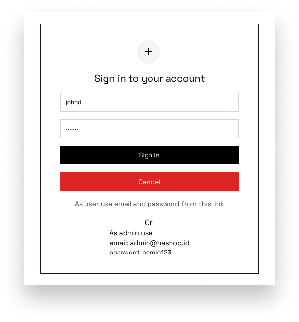

Tiap role memiliki hak akses yang berbeda-beda, yaitu:

1. Guest: hanya bisa melihat daftar produk, detail produk, dan dan beberapa component global lainnya. Tidak bisa menambahkan produk ke keranjang dan transaksi.

2. User: bisa melihat daftar produk, detail produk, menambahkan produk ke keranjang, dan melakukan transaksi. Tidak bisa mengakses halaman admin.

3. Admin: bisa melihat daftar produk, detail produk, mengakses halaman admin (Update stock & Sales Recap), dan tidak bisa menambahkan produk ke keranjang dan transaksi sebagaimana role Guest.

#### Karena rolenya berbeda maka terdapat juga perubahan pada Navbar sesuai dengan role pengguna yang sedang login.

- Guest
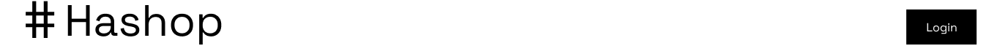

- User
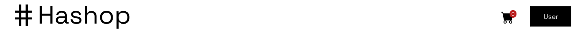

- Admin
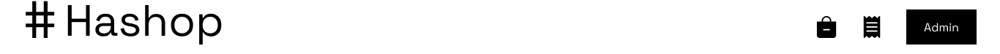

***

### 1. Halaman Utama (Home) 🏠

Halaman utama adalah halaman yang pertama kali muncul ketika pengguna membuka aplikasi. Halaman ini berisi Welcome Hero Section, Top Product Bestseller, Category, dan CTA card section berdasakan kategory. Pengguna dapat melihat melihat detail produk, dan menambahkan produk ke keranjang belanja dengan ketentuan harus login sebagai user terlebih dahulu.

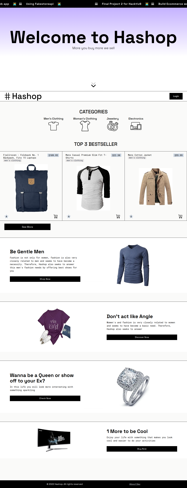

### 2. Halaman Produk (Product) 🗒️
Secara default halaman ini akan menampilkan semua daftar produk. Pengguna bisa filter produk berdasarkan kategori, atau urut berdasarkan property produk (Masi dalam tahap development).

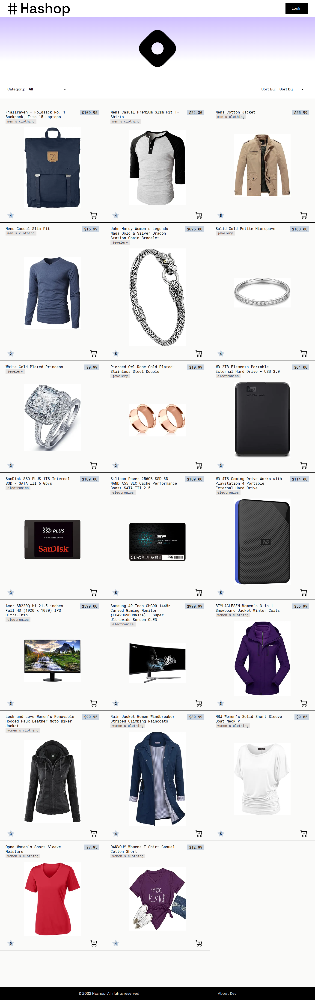
### 3. Halaman Detail Produk (Detail Product) 📜
Halaman ini muncul ketika card produk diklik. Halaman ini berisi detail produk, dan juga terdapat tombol untuk menambahkan produk ke keranjang belanja. Pengguna dapat melihat melihat detail produk, dan menambahkan produk ke keranjang belanja dengan ketentuan harus login sebagai user terlebih dahulu.

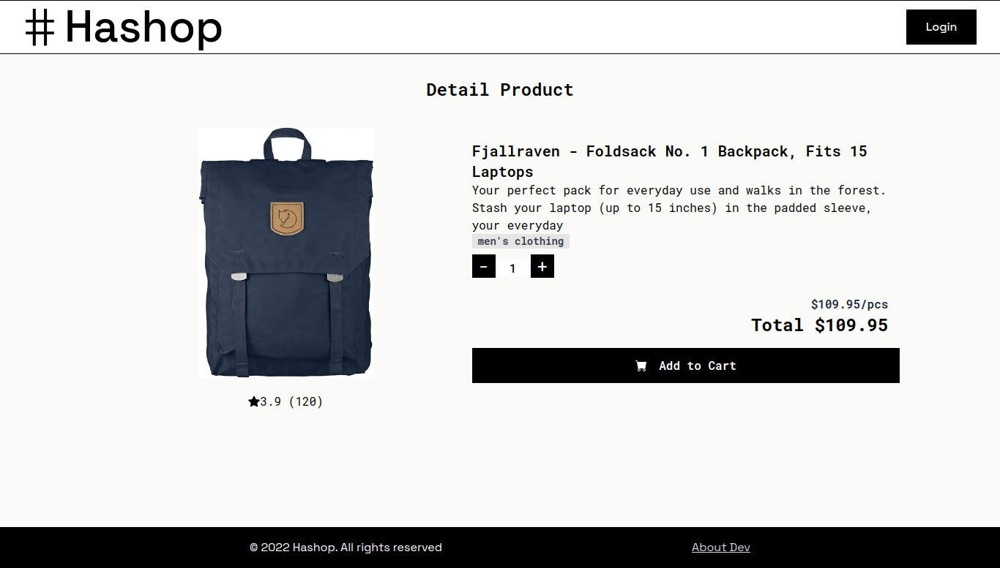

### 4. Halaman/Modal Keranjang Belanja (Cart - User) 🛒
Halaman/Modal ini muncul ketika tombol keranjang belanja di navbar diklik pada role user. Halaman ini berisi daftar produk yang telah ditambahkan ke keranjang belanja. Pengguna dapat mengubah jumlah produk yang akan dibeli, menghapus produk dari keranjang belanja, dan melanjutkan ke halaman checkout.

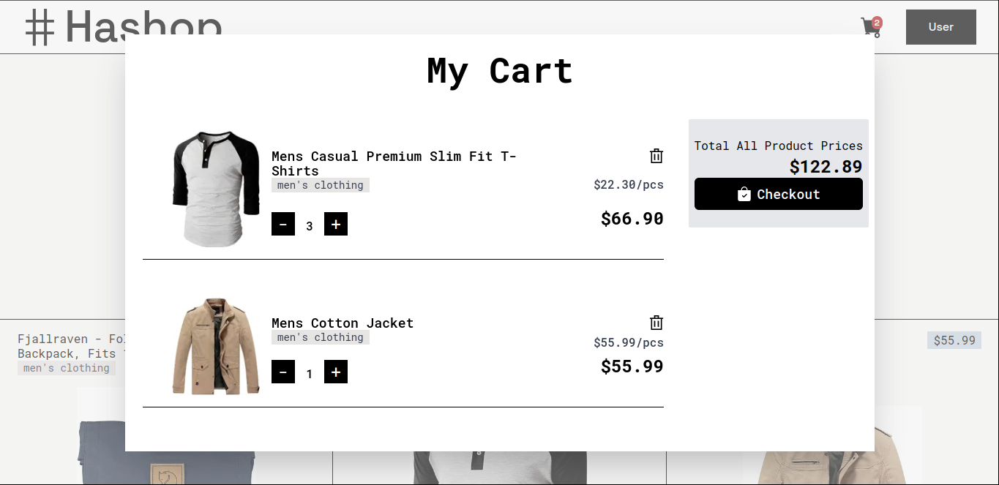

### 5. Halaman Update Stock (Update Stock - Admin) 🗄️
Halaman ini muncul ketika tombol update stock di navbar diklik pada role admin. Halaman ini berisi daftar produk yang dapat diupdate stocknya. Pengguna dapat mengubah stock produk, dan menghapus produk dari daftar produk.

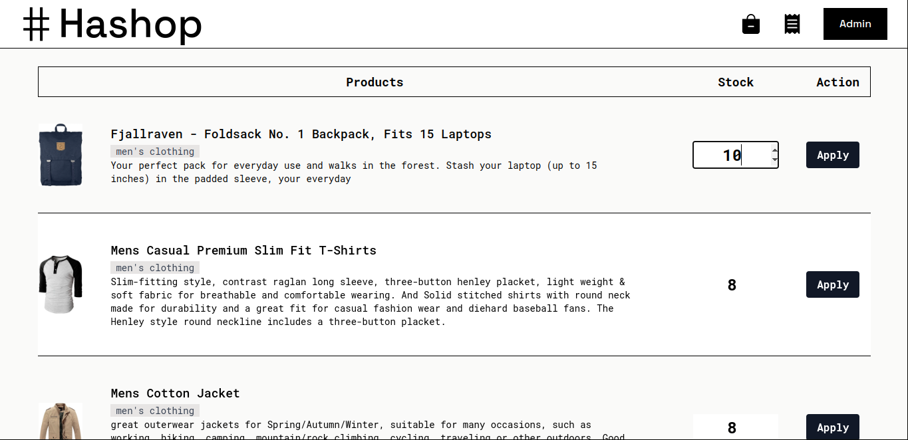
### 6. Halaman Sales Recap (Sales Recap - Admin) 📈
Halaman ini muncul ketika tombol sales recap di navbar diklik pada role admin. Halaman ini berisi daftar transaksi yang telah dilakukan oleh user. Pengguna dapat melihat total transaksi.

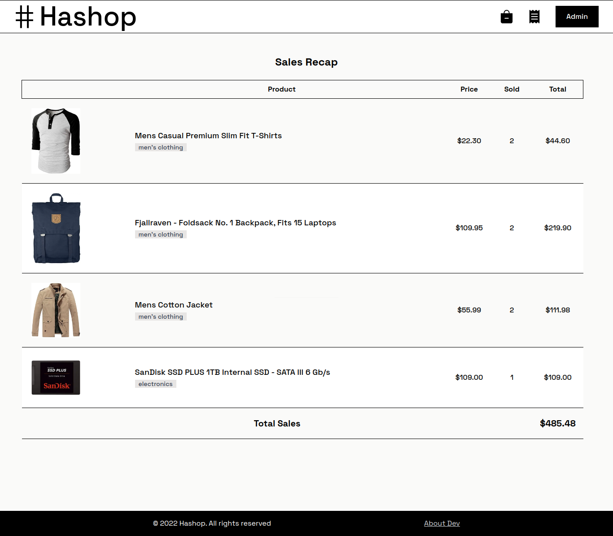

### 7. Halaman About Dev (About Dev) 👨‍💻 
Halaman ini berada di footer web app. Halaman ini berisi informasi mengenai developer dan info secara singkat pada proses management pengembangan web.

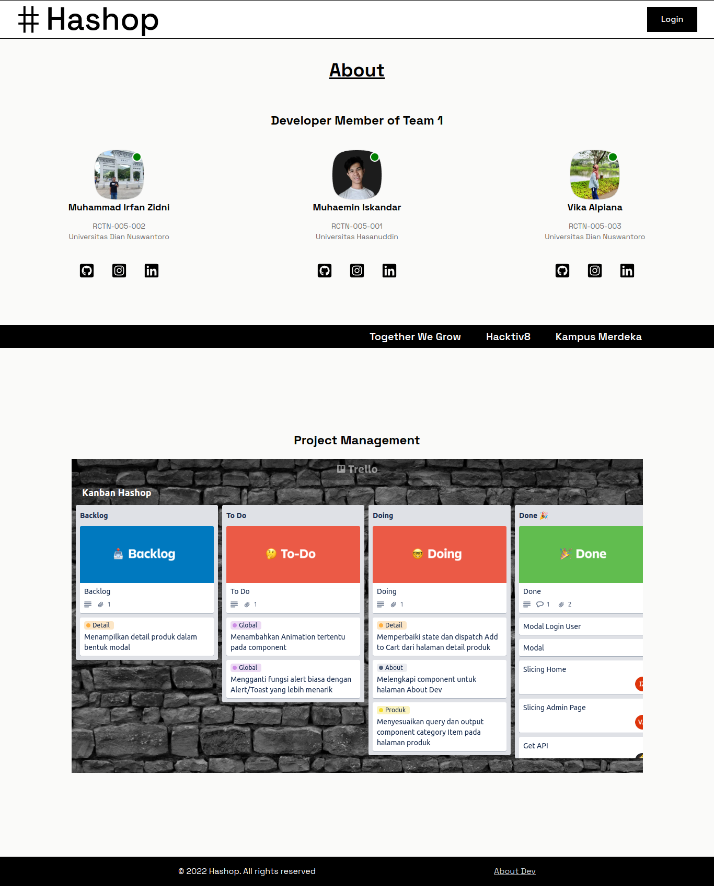

* Note: *Kedepannya akan dilakukan pengembangan lebih lanjut terkait project web app ini. Terima kasih.*

[Silahkan lihat panduan terkhusus bagi Reviewer dan Developer di link ini](./docs)

