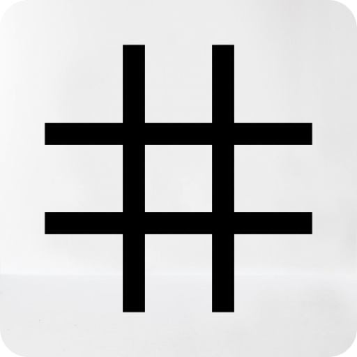

<div align="center">

  <h1>Hashop</h1>
  <p><b>Final project 2 - Kelompok 1</b></p>
</div>
<br/>

## Tentang Aplikasi 📖
1. Konsep design yang digunakan: Blutarism dengan dasar warna putih dan biru beserta ungu gradient sebagai tambahan.
2. Font : Space Grotesk (Font Sans), Roboto Mono (Font Mono).
3. Menggunakan strategi data fetching ISR (Incremental static regeneration) untuk produk dan hanya dilakukan sekali, disimpan ke store dan digunakan kesemua halaman atau komponen. Jadi tidak perlu melakukan fetch data lagi ke API misalnya untuk tampilan detail produk dan kategori.
3. Halaman: Home, Products, detail product, Update Stock dan Sales Recap serta About Dev.
4. Modal: Cart + Checkout, dan Login.
5. Fitur Komponen wajib: (Mengikuti [Instruksi](https://) dari Hacktiv8)
6. Fitur Komponen tambahan: Loading Streaming per Card, Filter Product berdasarkan kategori, tambahan beberapa hero section di home page, compress output image, optimasi SEO, dan beberapa fitur lainnya.

    Note    
    - Secara garis besar inspirasi desainnya berasal dari output image API-nya yang backgroundnya berwarnah putih (jpg) dan tidak sepenuhnya transparant. Untuk itu, warna putih digunakan sebagai background utama supaya gambarnya terlihat menyatu.
    - Dari hal itu terpikirkan untuk menerapkan sistem design blutarism yang sifatnya kaku makanya hampir tiap komponenen setidaknya memiliki sistem sudut siku-siku termasuk font berikut ke logo dan nama brandnya. 
    - Logo yang paling mendekati dari sistem desain yang diterapkan adalah '#' (hashtag).
    - Nama Brandnya pun diambil menggabungkan dua kata yaitu 'Hashtag' (dari logo) dan 'Shop' (dari jenis project web) sehingga menjadi '**Hashop**'.


---
<br/>

&nbsp;


<p align="left">Selasa, 15 November 2022 | 11:30 - 13.00 WIB</p>

* Instruktur oleh Bpk. Arif Setiawan
## 👨‍💻 Tim Member
* Muhammad Irfan Zidni  (RCTN-KS05-002)
* Muhaemin Iskandar     (RCTN-KS05-001)
* Vika Alpiana          (RCTN-KS05-004)


## ⚡Presentasi
    
1.  PowerPoint ✅
2.  Management Project Trello ✅
3.  Desain Figma ✅
4.  Panduan Penggunaan ✅
5.  <details>
    <summary>Coding ✅ </summary>
    <ul>
    <li>Setup code</li>
    <li>Install Library</li>
    <li>Structur Projek</li>
    <li>Component</li>
    <li>Page</li>
    <li>Database - Local Storage</li>
    </ul>
    </details>
6. Demo Aplikasi ✅  


## 📝 Dokumentasi
- [x] [Panduan](Panduan-aplikasi-fp2.pdf)
- [x] [Power Point]()
- [x] [Trello](https://trello.com/b/B6jRcl3z/kanban-hashop)
- [x] [Figma](https://www.figma.com/file/njA9sGky0KzgxkLWR3aCx8/Design-FP2?node-id=0%3A1&t=OQynp4GFsrN1KwoX-1)


----

## 🍄 Gambaran Logic & Data Store
[Flowcart dan UML](FC&UML.png)
atau
[Klik disini](https://www.figma.com/file/njA9sGky0KzgxkLWR3aCx8/Design-FP2?node-id=2%3A2033&t=OQynp4GFsrN1KwoX-1) di Figma.

----
<br/>

## Panduan untuk Developer 🧑‍💻

Pertama, Install NextJS dan semua dependensi yang dibutuhkan.

- (Ini dilakukan jika membuat project baru)

```bash
npx create-next-app
# atau
yarn create next-app
# atau
pnpm create next-app
```
- Masukkan nama project dan pilih template yang akan digunakan ketika diminta.
- Install dependensi yang dibutuhkan

```bash
npm install <nama-package>
```
- Masuk ke direktori project dan jalankan server development.
```bash
cd <nama project>
npm run dev
```
- Jika ingin menjalankan server production, jalankan perintah berikut.
```bash
npm run build
npm start
```

---

## Panduan untuk Kontributor 🤝

- Fork/Clone repository ini.
- Masukkan pada CLI.
```bash
git clone <link-repo>
```
- Install semua dependensi sesuai project ini dengan perintah berikut.
```bash
npm install
```
- Silahkan lakukan pengembangan pada project ini.
- Buat branch baru untuk mengerjakan fitur baru.
```bash
git checkout -b <nama-branch>
```
- Setelah selesai mengerjakan fitur, lakukan commit dan push ke branch yang telah dibuat.
```bash
git add .
git commit -m "<pesan commit>"
git push origin <nama-branch>
```
- Buat pull request ke branch `main` dari repository ini.
- Tunggu sampai pull request disetujui dan di-merge.


---
<br/>

## Top Technology 🚀
<div align="left"> 
 
  


</div>

----
<br/>

## Learn More

To learn more about Next.js, take a look at the following resources:

- [Next.js Documentation](https://nextjs.org/docs) - learn about Next.js features and API.
- [Learn Next.js](https://nextjs.org/learn) - an interactive Next.js tutorial.

You can check out [the Next.js GitHub repository](https://github.com/vercel/next.js/) - your feedback and contributions are welcome!

